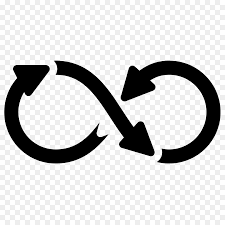

# Git project for Udemy classes
#### This is my first repo on GitLab and I am learning about Git

**During this *project* I will test the commands of Git as:**
* git init
* git add
* git branch
* git pull
* git push
* git status
* git log

**I have some objectives starting this learning process:**
1. Learn about Git
2. Learn about Docker
3. Learn about cloud
4. Work with DevOps
5. Try to teach about this knowlege with who need

